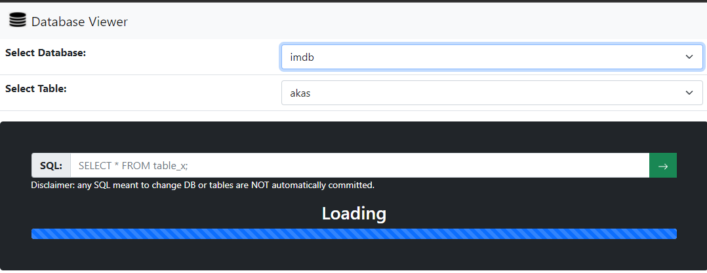
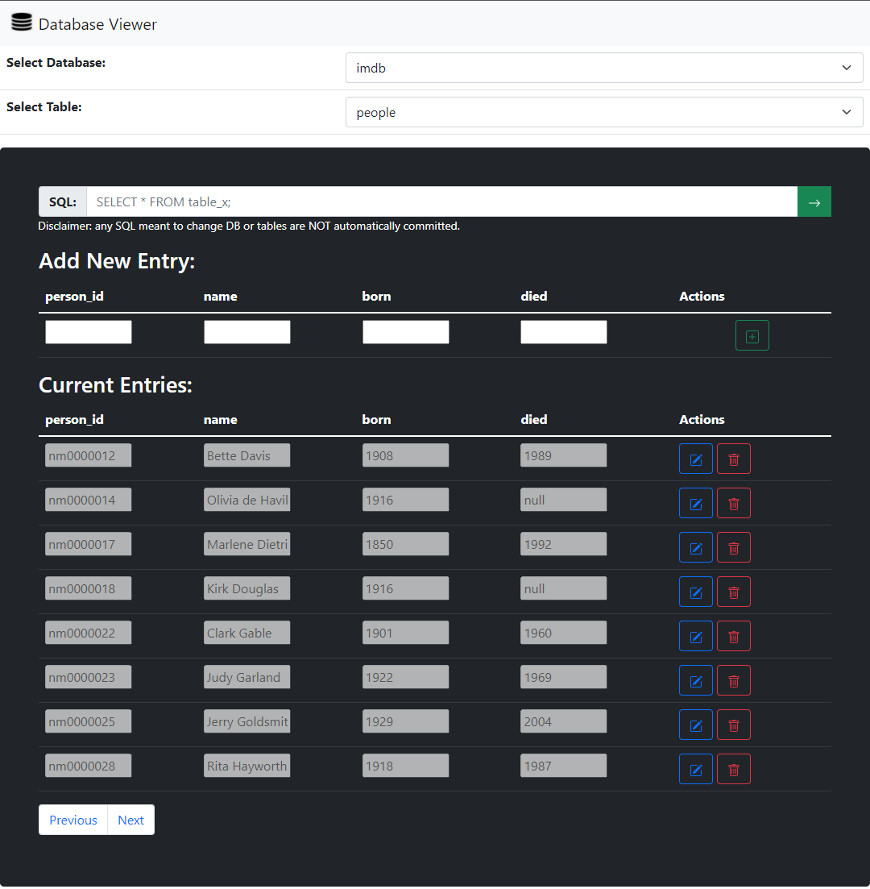
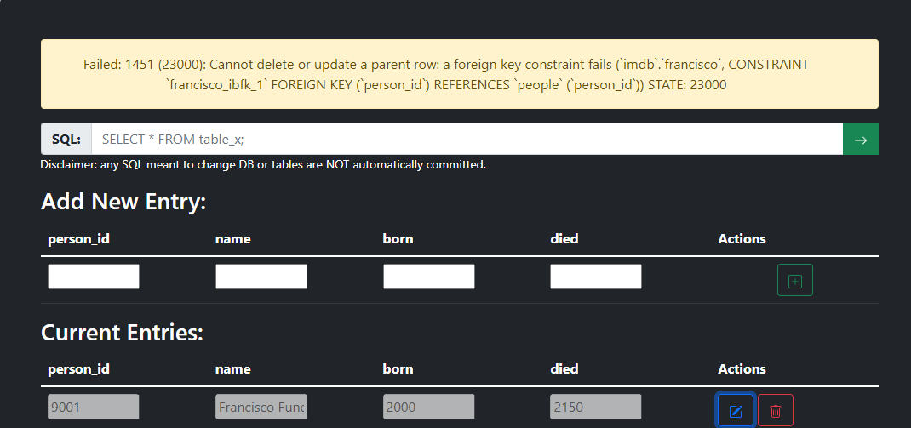
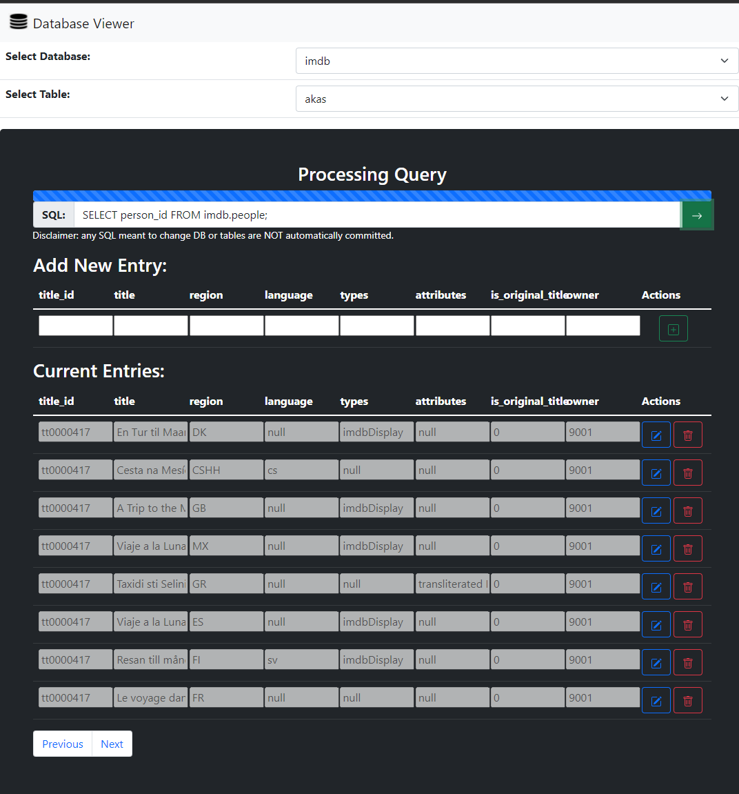

# Database Viewer Application

## Description
As part of Database course, we were instructed to create a AWS powered SQL database viewer. I chose to use Python for the backend, html styled with bootstrap for the frontend, and javascript to parse server request and render tables on the frontend. When the application first loads it queries the backend for table data, the backend creates a sql connector and polls the AWS database for information, lastly the result is parsed by the javascript and if favorable, a table will be displayed representing the SQL table stored in the cloud. 

## Running the project
To run it locally, type ```python app.py``` into a terminal window positioned in the project directory folder. Unfortunately, the AWS account expired so the server data cannot be polled, so a table won't be populated. 

## Screenshots

Loading:


Table Displayed:


Error Handling: 


Running Query:

